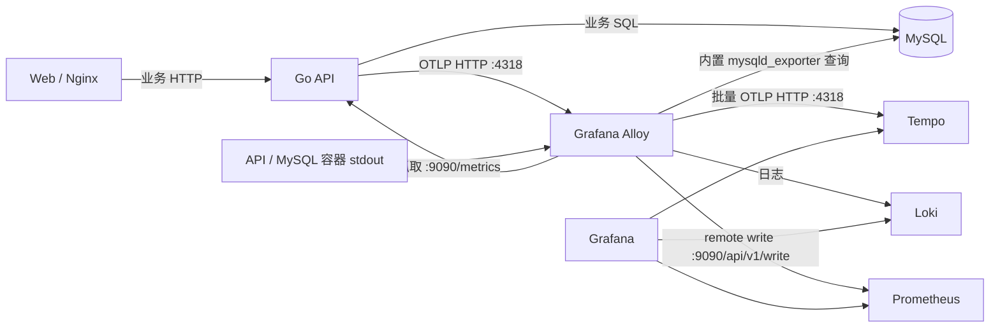

# 博客系统可观测性接入方案

本文说明 `feat/backend-observability` 分支的实际实现、运行方式与验收方法。配置以仓库文件为准；文中的验证记录来自 2026-10-10 的本地 Compose 环境。

## 1. 目标与实现范围

通过 Grafana 查看 API 的可用性、请求量、错误、延迟和运行资源，沿着 Trace 定位业务与数据库耗时，并跳到同一次请求的详细日志。数据库另有独立看板，读取 MySQL 自身的连接、查询、锁、缓存、I/O 和容量指标。

当前采用 Go OpenTelemetry SDK、Prometheus、Tempo、Loki、Grafana Alloy 和 Grafana。Alloy 统一负责 API/MySQL 指标抓取、Docker 日志采集与 OTLP Trace 接收，分别转发到 Prometheus、Loki 和 Tempo。没有额外的独立 MySQL exporter 容器，也没有单独部署 OTel Collector。

本地和发布 Compose 均默认开启 `OBS_DEBUG_RAW=true`，按本次接入要求保留文本请求/响应原文及 SQL 参数、结果。它是明确的调试配置：日志可能包含密码、会话相关值和文章正文，不能将这套配置描述成自动脱敏的生产基线。其实际捕获边界见第 5 节。

## 2. 数据流与部署



| 组件 | 固定镜像版本 | 作用与端口 |
| --- | --- | --- |
| Prometheus | `prom/prometheus:v3.5.0` | 内网 `9090`；接收 Alloy 的 API/MySQL remote write；开启 exemplar 存储。 |
| Tempo | `grafana/tempo:2.8.2` | 内网 `4318` 接收 Alloy 转发的 Trace，`3200` 提供查询；本地文件存储。 |
| Loki | `grafana/loki:3.5.0` | 内网 `3100`；存储和查询日志，单实例文件存储。 |
| Alloy | `grafana/alloy:v1.20.1` | 内网 `4318` 接收 OTLP HTTP Trace；Docker 日志、API 指标和 MySQL exporter 采集及转发。 |
| Grafana | `grafana/grafana:12.0.2` | 默认绑定 `127.0.0.1:3000`；自动配置数据源和看板。 |

五个组件都属于 `observability` profile。普通 Compose 启动仍可单独运行博客。API 指标监听 `:9090`，业务监听 `:8081`，两个 HTTP Server 独立启动和退出；API、MySQL、Alloy、Prometheus、Tempo、Loki 不发布宿主机端口。Nginx 对外部 `/metrics` 返回 404，API 业务路由也不提供此路径。

MySQL、上传文件及各可观测组件均有持久化卷。`docker compose down` 保留卷，`down -v` 会删除数据，应只在明确需要重置时执行。Loki/Tempo 当前未配置显式日志或 Trace 留存期限；落盘不等于备份、灾备或长期留存方案。

## 3. 运行与配置

### 3.1 本地启动

首次配置时复制 `.env.example` 为 `.env`，将 `OTLP_ENDPOINT` 改为 `alloy:4318`。已有 `.env` 时直接修改对应项，然后运行：

```bash
docker compose --profile observability up --build --wait -d
```

博客入口为 `http://localhost:8080`，Grafana 为 `http://localhost:3000`。本地 Grafana 用户为 `admin`，初始化密码默认是 `local-observability-only`，可通过 `GRAFANA_ADMIN_PASSWORD` 设置。已有 Grafana 数据卷保存了账号配置，修改初始化环境变量不会自动重置已有密码。

修改 API 环境变量后需要重新创建容器；单纯 `restart` 不会采用新的 Compose 环境变量。仅更新 API 时可执行：

```bash
docker compose --profile observability up -d --no-deps --force-recreate api
```

### 3.2 发布配置

在发布环境配置必填的镜像、数据库、来源及演示账号变量后，通过 `compose.release.yaml` 启动同一 profile：

```bash
docker compose -f compose.release.yaml --profile observability up --wait -d
```

本地和发布均设置 `OTLP_ENDPOINT=alloy:4318`，只启用普通博客服务时保持为空。迁移旧环境时将原来的 `tempo:4318` 改为 `alloy:4318`，再应用采集与服务配置：

```bash
docker compose --profile observability up -d --force-recreate alloy prometheus
docker compose --profile observability up -d --no-deps --force-recreate api
```

发布环境使用相同命令时，在 `docker compose` 后加上 `-f compose.release.yaml`。

Alloy 的 `otelcol.receiver.otlp` 监听内网 `0.0.0.0:4318`，Trace 经过 `otelcol.processor.batch`（1 秒超时、1024 Span 发送阈值）和 `otelcol.exporter.otlphttp` 转发到 `http://tempo:4318`。exporter 开启内存发送队列（1000 个批次）及失败重试（最长 300 秒）；队列不是持久化缓冲，重启或持续故障时仍可能丢失 Trace。采样仍由应用的 `TRACE_SAMPLE_RATIO` 控制，Alloy 没有额外采样。Trace ID、Span ID 和日志关联不变。

| 变量 | 本地默认 | 发布默认 | 说明 |
| --- | --- | --- | --- |
| `OTLP_ENDPOINT` | 空 | 空 | 设置为 `alloy:4318` 才导出 Trace；格式为 `host:port`，当前使用内网明文 HTTP。 |
| `TRACE_SAMPLE_RATIO` | `1` | `0.1` | 范围 0～1，采用 ParentBased + TraceIDRatioBased；上游采样决定也会影响结果。 |
| `OBS_DEBUG_RAW` | `true` | `true` | 文本原文及 SQL 诊断开关；设为 `false` 关闭详细原文日志。 |
| `METRICS_ADDR` | Compose 固定 `:9090` | Compose 固定 `:9090` | 进程在 Compose 外单独运行时默认 `127.0.0.1:9090`。 |
| `MYSQL_PASSWORD` | 本地演示值 | 必填 | API 与 Alloy 当前共用 `blog` 数据库账号的密码。 |
| `GRAFANA_ADMIN_PASSWORD` | 本地演示值 | 同一本地默认值 | 发布时应自行设置独立密码。 |
| `GRAFANA_PORT` | `3000` | `3000` | 宿主机端口。 |
| `GRAFANA_BIND` | 本地固定回环地址 | `127.0.0.1` | 发布 Compose 可调整绑定地址。 |

`.env.example` 写有 `TRACE_SAMPLE_RATIO=1`。复制后将它用于发布 Compose 会覆盖发布默认的 `0.1`；需要 10% 采样时应显式修改该项。采样只影响 Trace，HTTP 指标与日志仍会记录未采样请求。`OTLP_ENDPOINT` 为空时依然可能生成 Trace ID，但 Tempo 中没有对应数据，不能仅凭日志中存在 ID 判断导出成功。

完整原文日志不会自动去除敏感字段，发布配置也保持开启。实际部署需管理 Grafana/Loki 的访问、日志留存和导出权限。Alloy 挂载的 Docker socket 即使标注 `:ro`，仍可调用具有敏感权限的 Docker API。

## 4. API 与资源指标

Alloy 每 15 秒抓取 `api:9090/metrics`，保留 `job=blog-api`、`instance=api:9090`，通过 remote write 写入 Prometheus。Prometheus 不再重复抓取 API，避免重复样本。API 的 `up` 抓取状态也由 Alloy 写入，因此 Prometheus Targets 页面为空是预期行为，应查询 `up{job="blog-api"}` 查看抓取状态。请求计数使用 `method`、路由模板 `route`、状态码 `status`；耗时直方图使用 `method`、`route`。无法匹配的路径统一为 `unmatched`，文章 ID、请求 ID 和 Trace ID 不进入普通指标标签。

| 指标 | 含义 |
| --- | --- |
| `http_requests_total` | 请求累计计数；用 `rate()` 求 QPS。 |
| `http_request_duration_seconds_bucket` | 请求耗时直方图，单位秒；用 `histogram_quantile()` 求 p50/p95/p99。 |
| `process_resident_memory_bytes` | API 进程 RSS。 |
| `process_cpu_seconds_total` | 进程累计 CPU 时间；其 `rate()` 表示占用核数，1.0 表示一个 CPU 核。 |
| `go_goroutines`、`go_threads` | 协程与线程数量。 |
| `go_memstats_*`、`go_gc_duration_seconds_*` | Go 内存与 GC。 |
| `blog_db_connections_open` | API 连接池已打开的连接数。 |
| `blog_db_connections_in_use`、`blog_db_connections_idle` | 使用中与空闲连接数。 |
| `blog_db_connections_max` | API 连接池上限，当前为 20。 |
| `blog_db_connection_waits_total` | 等待获取连接的累计次数；当前没有单独导出等待总时长。 |

健康检查 `/api/v1/health/live` 和 `/api/v1/health/ready` 仍计指标，但不写请求与正文日志。业务看板通过路由条件排除它们，以避免低流量时健康检查占满业务图。健康检查 Trace 未被专门排除，Traces Drilldown 中的速率与业务 QPS 因而不一定相同。

已采样请求的耗时指标附带 `trace_id` exemplar，使用 OpenMetrics 输出；Alloy remote write 显式开启 `send_exemplars`，Prometheus 启用 `exemplar-storage` 保存它，Grafana 延迟趋势查询开启 exemplar 展示。它不会给每个 Trace 创建独立时间序列。

5xx 比例、延迟阈值和连接使用率颜色是排查参考，当前没有配置告警规则、通知渠道或 SLO。无业务请求时延迟分位数可能为 NaN，首页将其显示为“无请求”。API 抓取状态证明指标端口可访问，不等同于业务流程全部正常。

## 5. 日志与原文记录

API 使用 `slog` JSON 输出到 stdout。Alloy 通过 `discovery.docker`、`discovery.relabel` 和 `loki.source.docker` 发现 API/MySQL 容器，将日志写入 Loki。

| 字段 | 用途 |
| --- | --- |
| `requestId` | 对应 HTTP 响应头 `X-Request-ID`，定位一次请求。 |
| `traceId`、`spanId` | 与当前请求的 Trace/Span 关联。JSON 正文字段使用驼峰命名。 |
| `method`、`route`、`status`、`durationMs` | HTTP 请求概况。 |
| `msg` | 区分请求、正文、SQL 查询、行结果、查询结束与异常。 |
| `queryId` | 进程内 SQL 查询序号，用于配对 SQL 与结果；不能用作跨进程全局 ID。 |
| `part`、`body` | 正文分块序号与文本。 |

Loki 的稳定标签包括 `service=api` / `service=mysql`、Compose `project` 等。请求与 Trace ID 保留在正文中，通过 JSON 解析筛选，所以标签列表里只有少量标签属于正常行为。

### 5.1 HTTP 原文的实际边界

`OBS_DEBUG_RAW=true` 时捕获 `application/json`、`application/problem+json`、表单编码与 `text/*` 的正文。有效 UTF-8 文本按约 16 KiB 分块，不截断字符；无效 UTF-8 的捕获内容以 Base64 分块记录。图片及其他二进制响应、multipart 上传不打印。

请求体记录的是 handler 实际读取的字节。若请求在读取正文前被拒绝，或 handler 没有消费全部内容，日志不会补读剩余字节。响应记录写给响应 writer 的文本正文。当前不记录全部 HTTP 头，也不应把此功能称为 HTTP 抓包或完整网络报文记录。原文捕获需要额外内存与日志 I/O，分块仅限制单条正文日志大小，不限制总捕获量。

### 5.2 SQL 与结果

API Repository 的 DB/Tx 包装器记录 SQL 模板与参数；查询结果在 `Scan()` 时记录值，多行查询还记录列名、行序号和关闭时的已扫描行数；写入记录受影响行数和可获取的插入 ID。它覆盖经该包装器执行的操作，不记录其他客户端、迁移/种子任务的全部 SQL，也不补读没有扫描的结果行。

`database/sql` 采用参数化执行，代码无法获得 MySQL 服务器最终解析后的 SQL 文本。日志分别保留 `sql` 和 `args`，不拼接成声称“服务器实际执行”的字符串。SQL 日志当前没有单独进行长字段分块，异常大的结果字段仍可能遇到 Loki 单条日志限制；HTTP 正文分块不能解决这个问题。

示例查询：

```logql
{service="api"} | json | msg="http request"
{service="api"} | json | level="ERROR"
{project="blog-engineering-demo",service="api"} | json | traceId="替换为真实的32位trace_id"
{service="mysql"} |~ `(?i)\[(error|warning)\]`
```

`| json traceId="..."` 是 JSON 字段提取配置，不是过滤条件。要过滤必须写成 `| json | traceId="..."`，第二个管道不能省略。

当前 Docker 发现规则同时匹配 `blog-engineering-demo` 和 `blog-engineering-release`。同一 Docker 主机同时运行两套环境时，每个 Alloy 可能都发现两套容器；进一步隔离时需将发现规则限制到本实例的 project，并在看板查询中加入 project 条件。

## 6. Trace 与日志跳转

API 在入口用 `otelhttp` 创建服务端 Span，并将名称改为 HTTP 方法加路由模板。支持 W3C `traceparent` 传播，资源名称为 `service.name=blog-api`。当前手动子 Span 包括文章列表、详情、关联标签/收藏、标签列表、评论列表、文章状态转换等；查询范围不代表每条 SQL 都有独立 Span。

典型调用树：

```text
GET /api/v1/articles
└─ db.ListArticles
   ├─ db.LoadArticleRelations [article.id=...]
   └─ db.LoadArticleRelations [article.id=...]
```

日志存储在 Loki，Span 存储在 Tempo。SQL 和正文日志不会作为全部 Span 事件复制进 Trace 瀑布图。

| 跳转方向 | 当前实现 |
| --- | --- |
| 日志 → Trace | Loki `derivedFields` 用 `"(?:traceId|trace_id)":"([a-f0-9]{32})"` 识别正文 ID，生成 Grafana Explore 链接。 |
| 延迟指标 → Trace | Prometheus exemplar 的 `trace_id` 通过数据源链接打开 Tempo。 |
| Span → 同一次请求日志 | Tempo `tracesToLogsV2` 的 Related logs 入口，打开 Loki 的 `{service="api"} | json | traceId="$${__span.traceId}"`。 |

Tempo 的日志跳转使用 Span 起止时间前后各扩展一分钟，并仅按 Trace ID 过滤，因此可以包含这次请求多个 Span 的日志。它仍受查询时间范围、Grafana 行数上限、日志是否成功写入以及留存范围限制；需要时扩大时间范围和行数上限。“同一 Trace 的日志”不包括没有该 ID 的后台任务或 MySQL 自身错误日志。

Grafana 12 中，原始 Trace ID 应使用 `queryType=traceId`。把 ID 放进 `queryType=traceql` 会导致错误的查询路径。本次日志与 exemplar 链接显式构造 Explore 的 `traceId` 查询，避免将 32 位 ID 当作 TraceQL。

Traces Drilldown 是 Grafana 的聚合探索页面，能按服务等属性展示速率和延迟。其 `rate()` 查询需要 Tempo metrics generator 的 `local-blocks`；当前已配置该处理器、生成器 WAL 与 traces storage，并开启 `flush_to_storage`。未启用时会出现 `error finding generators ... empty ring`。Tempo 本地存储是单实例演示方案，未配置高可用或独立的 Trace 派生指标远端存储。

## 7. MySQL 自身监控

Alloy 的 `prometheus.exporter.mysql` 内置 mysqld_exporter，读取全局状态与变量，并启用 `info_schema.tables`、限定 `databases=blog`。每 15 秒抓取一次，通过 `prometheus.relabel` 将 job 统一为 `blog-mysql`，再 remote write 到 Prometheus。内置 exporter 默认提供的 job 标签会覆盖 scrape 的默认 job，因此需要这一步 relabel。

采集器当前复用 `blog` 账号。禁用 `slave_status`，避免要求额外的复制权限；未为业务账号追加全局权限，也无需重新初始化已有 MySQL 数据卷。独立看板的指标来自数据库全局状态，API 连接池指标则来自 `database/sql`，两者的连接数含义不同。

| 关注问题 | 指标/面板与解释 |
| --- | --- |
| 连接饱和 | `threads_connected / max_connections`、执行线程、新建连接与 `connection_errors_total`；关注持续接近上限。 |
| 连接异常 | `aborted_connects`、`aborted_clients` 的来源各不相同；当前看板显示连接失败及错误分类，不能把计数直接归因到 API。 |
| 慢查询 | `slow_queries` 的速率、`long_query_time` 与 `slow_query_log` 实际配置；计数不是逐条 SQL 的耗时分布。 |
| 锁阻塞 | 当前行锁等待、新增行锁/表锁等待、窗口平均行锁等待时间；具体阻塞事务仍需进一步检查。 |
| 缓存压力 | buffer pool 命中率、数据与脏数据字节、等待空闲缓冲页；buffer pool 不等于 mysqld 全部 RSS。 |
| 刷盘压力 | InnoDB 读写字节速率、待完成 reads/writes/fsyncs、redo log waits。 |
| 临时表与低效查询线索 | 临时表/磁盘临时表、扫描、无索引 Join、排序合并速率；需结合数据量与执行计划判断。 |
| 容量变化 | `mysql_info_schema_table_size` 的 `data_length` 与 `index_length`；属于表统计估算，不是文件系统剩余空间。 |
| 数据库自身日志 | `service=mysql` 的 stdout 启动、警告与错误日志；日志面板回看 24 小时以覆盖启动事件。 |

查询速率包含 API、健康检查、采集器和其他客户端产生的 SQL。MySQL 8 的 TempTable mmap 不完整体现在磁盘临时表计数中，InnoDB 的 information_schema 统计也可能缓存；不能用这些面板声称已完成全部 SQL 性能分析。

当前未采集 mysqld 进程 CPU/RSS、主机磁盘余量、复制延迟、死锁详情、SQL Digest 或慢查询文件日志。后续可按需要加入主机/容器 exporter、专用最小权限监控账号、Performance Schema 采集与慢查询日志通道；这些是后续方案，不是本次已经交付的能力。

## 8. Grafana 看板与配置清单

数据源 UID 固定为 `prometheus`、`tempo`、`loki`。看板通过文件 provisioning 放入“博客系统”文件夹，每 10 秒检查文件，页面每 15 秒刷新。默认首页路径指向运行概览 JSON；看板由代码管理，禁止通过 UI 保存覆盖。

| 看板 | UID / 文件 | 内容 |
| --- | --- | --- |
| 博客系统 · 运行概览 | `blog-api-overview` / `api-overview.json` | 30 个面板，含 API 请求、资源、连接池、MySQL 摘要及日志；顶部进入 MySQL 详情。 |
| 博客 API · Go 运行时 | `blog-go-runtime` / `go-runtime.json` | 10 个面板，RSS、Go 堆、CPU 核数、协程、线程、GC、文件描述符。 |
| MySQL · 数据库健康 | `blog-mysql-health` / `mysql-health.json` | 32 个面板项，包含分组标题和说明，覆盖第 7 节指标与日志。 |

| 文件 | 作用 |
| --- | --- |
| `backend/cmd/api/main.go` | Trace 初始化、连接池指标、独立指标 Server、额外演示数据命令。 |
| `backend/internal/observ/` | OTLP HTTP exporter、资源、采样与传播及测试。 |
| `backend/internal/httpapi/metrics.go`、`debuglog.go`、`server.go` | HTTP 指标、原文捕获、关联日志与路由命名。 |
| `backend/internal/mysqlrepo/debug.go` | DB/Tx SQL 参数与扫描结果日志包装器。 |
| `backend/internal/application/article.go`、`mysqlrepo/articles.go`、`social.go` | 业务与数据库子 Span。 |
| `deploy/observability/prometheus.yaml` | Prometheus 配置；不再直接抓取 API，统一接收 Alloy remote write。 |
| `deploy/observability/alloy.alloy` | OTLP 接收/批量转发、API 指标抓取、Docker 日志、内置 MySQL exporter、标签修正与 remote write。 |
| `deploy/observability/tempo.yaml`、`loki.yaml` | Trace/日志存储与查询服务。 |
| `deploy/observability/grafana-datasources.yaml` | 数据源及日志、指标、Trace 跳转。 |
| `deploy/observability/grafana-dashboards.yaml`、`dashboards/` | 看板 provisioning 与 JSON。 |
| `compose.yaml`、`compose.release.yaml` | profile、版本、网络、卷和环境变量。 |
| `backend/internal/seed/extra.go`、`scripts/demo-traffic.py` | 可手动重复运行的测试内容与读取流量。 |

## 9. 测试数据与演示流量

启动并构建服务后，手动运行：

```bash
docker compose run --rm --no-deps api demo-data
python3 scripts/demo-traffic.py
```

额外数据命令增加 22 篇公开文章、1 篇草稿、1 篇下线文章、8 个标签、2 个读者账号、30 条评论和 11 条收藏。它不在普通迁移或发布启动时自动运行。账号 `reader1@blog.local`、`reader2@blog.local` 使用首次创建时的 `DEMO_PASSWORD`，默认 `Demo12345!`；重跑不会改写已有账号密码或文章正文。

顺序重复执行按作者/标题及评论内容检查已存在的数据，收藏与标签关联使用唯一键防重复；这是演示脚本，不支持并发执行的严格幂等保证。原始 3 篇文章、2 个标签及此前已有收藏加上扩展数据后，本次验证数据库共有 27 篇文章（25 篇公开）、10 个标签、30 条评论、12 条收藏；后续用户操作或集成测试会改变这些总数。

流量脚本仅发送读取请求，默认 120 次，间隔 0.15 秒，覆盖分页、详情、评论、搜索、标签与不存在文章的预期 404。一次执行约 20 秒，105 次返回 200、15 次返回 404；未制造 5xx、锁阻塞或慢查询。持续图中的异常计数为零可以是正常状态。

```bash
python3 scripts/demo-traffic.py --requests 600 --interval 0.2
```

脚本运行结束后 QPS 会随速率窗口回落，日志与 Trace 继续按时间范围查询。它没有自动运行或后台持续压测行为。

## 10. 验收与排查

### 10.1 验收方法

```bash
# 在 backend/ 下执行；未设置 BLOG_BASE_URL 时产品旅程集成测试会跳过。
go test ./...
go vet ./...

# 在仓库根目录执行。
docker compose --profile observability config --quiet
docker compose exec -T alloy alloy validate /etc/alloy/config.alloy
docker compose exec -T prometheus wget -qO- http://api:9090/metrics
```

具备所需发布变量时，也应检查 `docker compose -f compose.release.yaml --profile observability config --quiet`。针对已运行的本地博客，可显式设置 `BLOG_BASE_URL=http://localhost:8080` 执行 `go test ./integration -count=1`，该产品旅程测试会新增测试账号、文章和图片，应在测试环境运行。

本次本地验收已完成以下项目：

- Go 测试与 vet、Compose 配置解析、Alloy 配置验证；新测试覆盖路由模板标签、请求/Trace ID、exemplar 输出、错误关联、文本原文与 OTLP 导出。
- 三张 Grafana 看板加载；独立 MySQL 看板的 41 条指标查询返回数据，面板 ID 与布局无冲突。
- 扩展数据命令顺序执行两次，总数保持一致；公开列表第 3 页返回 5 篇文章。
- 演示读取流量生成 HTTP 指标和日志；真实 Trace ID 可由 Tempo 查询到。
- 开启 Prometheus exemplar 存储后，查询实际返回 18 条 exemplar，其中的 Trace ID 已在 Tempo 验证存在；Grafana 延迟趋势面板也已加载 exemplar 开关。
- MySQL stdout 被 Alloy 采集，Loki 能查询到启动日志与其中的警告；这是实际日志，不是合成故障。

2026-10-10 统一迁移到 Alloy 后补充验证：

- Alloy 配置验证、本地 Compose 及发布 Compose（普通/可观测 profile）解析通过；运行中的 API 确认使用 `OTLP_ENDPOINT=alloy:4318`。
- Prometheus 直接抓取 Targets 为零；Alloy 转发的 `up{job="blog-api",instance="api:9090"}` 和 `mysql_up{job="blog-mysql"}` 均为 1。
- 120 次只读演示请求返回 105 次 200、15 次预期 404；新请求的 Trace 在 Tempo 查询成功，同一 Trace 在 Loki 查到 30 条关联日志。
- 迁移后的时间范围查到 2 条新 exemplar，其中的 Trace ID 在 Tempo 验证存在，确认 API → Alloy → Prometheus 的 exemplar 转发链路成立。

上述结果是一次环境验收记录，不能代替后续环境里的实际检查。exemplar 端到端验收需要 Prometheus 查询返回 exemplar 且对应 ID 在 Tempo 存在，仅验证 API 文本里有 exemplar 不足以证明整条链路成立。

### 10.2 常见问题

| 现象 | 排查与处理 |
| --- | --- |
| Traces Drilldown 报 `empty ring` | 核对 Tempo `metrics_generator` 的存储与 `local-blocks` 处理器，重建 Tempo 后生成新请求。 |
| Trace ID 存在但打不开 | 检查 API 容器实际 `OTLP_ENDPOINT=alloy:4318`、采样率、API exporter 与 Alloy OTLP 转发错误；确认查询使用 `traceId` 类型，考虑批量导出延迟与留存范围。 |
| 精确 Trace ID 的 Loki 查询出现其他请求 | 使用 `| json | traceId="..."`；不要把 ID 写成 JSON 提取参数。 |
| Loki 标签很少 | 请求 ID、Trace ID、状态等字段保留在 JSON 正文，先解析再过滤。 |
| Span 跳转只出现部分日志 | 检查时间窗口、行数上限和日志是否被采集；当前按 Trace ID 查请求相关日志，不保证无限量返回。 |
| 延迟图没有 exemplar | 检查采样、OpenMetrics 输出、Alloy remote write 的 `send_exemplars`、Prometheus `exemplar-storage` 与面板的 exemplar 开关，并生成新请求。 |
| API 指标无数据 | 查询 `up{job="blog-api"}`，检查 Alloy 的 API scrape 和 remote write；Prometheus Targets 为空是统一采集后的预期状态。 |
| MySQL 面板无数据 | 检查账号连接、Alloy exporter、`job=blog-mysql` relabel 与 Prometheus remote-write receiver；不要只检查 Prometheus 的 API Targets。 |
| `slave_status` 权限错误 | 当前已禁用该采集器；需要复制监控时另建专用监控账号和授权。 |
| MySQL 日志面板为空 | 调整时间范围；无新事件时为空是正常的。新接入的历史日志可能在 Loki ingester 刷盘后才能被历史范围查询找到。 |
| 没有业务流量时分位数无值 | 检查抓取 UP 后生成读取流量；无样本不代表服务故障。 |
| Docker Hub 拉取超时或限流 | 本次曾使用用户提供的 `docker.1ms.run` 拉取缺失镜像并标记为 Compose 所用名称；镜像代理只是环境下载手段，仓库保留官方镜像名称与固定版本。 |

当前是可复现的单实例接入：还需要另行设计告警与通知、明确留存及容量控制、监控账号隔离、多环境日志隔离、TLS/鉴权、备份和高可用，才能作为完整的线上运维方案。
