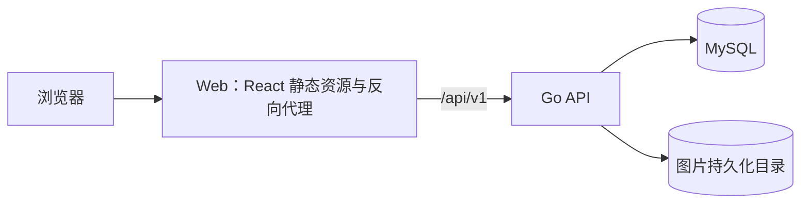
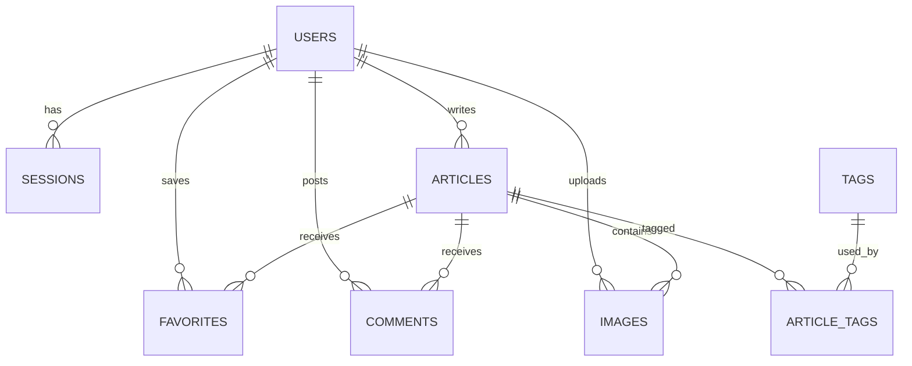

# 博客系统技术方案

> 依据：[产品需求文档](./PRD.md) v1.0  
> 目标：前后端分离、可本地复现、支持 Docker Compose 一条命令启动

## 1. 总体设计

前端使用 **React + TypeScript**，后端使用 **Go 分层单体**，业务数据保存在 **MySQL**。浏览器只访问 Web 服务；Web 服务提供前端静态资源，并将 `/api` 请求转发给 Go API。这样本地演示只有一个访问入口，注册、登录和图片访问使用同一站点地址。



后端保持一个进程，但按业务边界拆分代码。当前需求没有独立部署各模块的必要；模块边界仍通过接口和测试保持清晰。

### 1.1 技术选型

| 范围 | 方案 | 选择原因 |
| --- | --- | --- |
| 前端 | React、TypeScript、Vite | 组件化开发，构建产物可作为静态文件运行。 |
| 页面路由 | React Router | 管理公开页面与登录后页面。 |
| 远程数据 | TanStack Query | 管理请求、缓存失效与保存后的页面同步。 |
| 样式 | 全局 CSS + 设计变量 | 用统一的色彩、间距和排版规则实现温暖视觉语言。 |
| 正文 | Markdown；前端使用 `react-markdown` 渲染 | 适合文章中的标题、引用、列表、代码和图片。禁用原始 HTML。 |
| 后端 | Go、`net/http`、Chi | 使用标准 HTTP 能力，Chi 负责路由和中间件组织。 |
| 数据访问 | `database/sql` + MySQL 驱动，手写 Repository | SQL 行为明确，适合展示数据约束和事务边界。 |
| 数据库 | MySQL 8.4 | 统一保存用户、文章、标签、收藏、评论、会话和图片元信息。 |
| 数据迁移 | Goose SQL 迁移 | 迁移文件纳入版本管理，由 Compose 中的独立任务执行。 |
| 图片 | Go API 接收和读取；文件放在持久化卷 | 本地演示无需对象存储账号，访问时仍能检查文章权限。 |
| 本地运行 | Docker Compose | 统一启动 Web、API、迁移和 MySQL。 |

依赖版本写入前端锁文件、Go 模块文件和镜像标签，镜像不使用 `latest`。

## 2. 前端设计

### 2.1 页面分组

| 分组 | 页面 | 对应需求 |
| --- | --- | --- |
| 公开阅读 | 首页、文章详情、搜索结果、标签结果 | FR-01～FR-06 |
| 账号 | 注册、登录 | FR-07～FR-10 |
| 个人内容 | 我的收藏 | FR-11～FR-14 |
| 博主工作台 | 文章列表、编辑、预览、回收站 | FR-15～FR-23 |
| 管理员 | 用户权限、标签、全站文章与评论 | FR-24～FR-26 |

页面路由负责可见入口和跳转；真正的权限判定始终由后端执行。注册、登录、退出后刷新当前用户信息并清理相关缓存。文章发布、下线、恢复和收藏操作成功后，刷新相应列表与详情，避免界面显示过期状态。

前端以 `App.tsx` 组织路由，`pages/` 放公开、账号和管理页面，`api.ts` 统一处理请求及错误，`auth.ts` 管理当前用户状态。页面组件组合界面与业务交互，请求入口保持集中。

编辑器首版使用 Markdown 文本编辑区和并排或切换式预览。图片上传成功后插入带替代文字的 Markdown 图片引用。发布按钮只在文章满足必填条件时可用，但服务端仍再次校验。

### 2.2 温暖风格

视觉方向为温暖、安静的编辑式阅读界面。以浅米色背景、深棕文字和陶土色操作强调构成主色；正文保持足够留白，卡片和边框轻量，避免大面积装饰影响阅读。

| 用途 | 建议色值 |
| --- | --- |
| 页面背景 | `#F8F4EC` |
| 内容表面 | `#FFFCF7` |
| 主要文字 | `#312B26` |
| 次要文字 | `#66594E` |
| 主操作色 | `#8B452F` |
| 边框 | `#E5D9CB` |

正文采用易读的系统无衬线字体，标题可使用系统衬线字体；不依赖在线字体服务。正文列宽控制在约 `720px`，管理页可以更宽。手机端将侧栏内容移入抽屉或折叠区。交互状态包括悬停、焦点、禁用、加载、成功和错误；文字及按钮对比度按 WCAG AA 验证。图片需要替代文字输入，键盘应能完成主要操作。

## 3. Go 后端分层

```text
backend/
  cmd/api/                  # 组装依赖并启动服务
  internal/
    httpapi/                # 路由、请求/响应、中间件
    application/            # 文章和互动用例
    domain/                 # 实体、状态转换、权限规则
    mysqlrepo/              # MySQL Repository 与本地图片元信息
    auth/                   # 密码摘要与校验
    dbschema/migrations/    # 版本化数据库迁移
    seed/                   # 幂等演示数据
```

文章和互动操作的调用方向为 `HTTP → Application → Domain/Repository 接口 → MySQL Repository`。HTTP 层处理输入、会话和状态码；应用层执行文章保存、状态转换、收藏和评论用例；领域层判断文章状态与权限；Repository 负责 SQL 和事务。注册、登录、标签管理及图片上传目前由 HTTP 层调用对应的认证模块、Repository 或文件存储代码。这是首版的实际边界，后续增加复杂规则时再抽出相应应用用例。

主要业务模块为 `auth`、`articles`、`tags`、`favorites`、`comments`、`media` 和 `admin`。跨模块动作由应用用例编排。例如删除文章只改变文章状态，保留关联的收藏、评论和图片；恢复时这些内容按文章公开状态重新可见。

### 3.1 事务与并发

- 注册时依靠规范化邮箱唯一约束阻止重复账号；创建用户和登录会话分别按业务结果处理。
- 文章正文、标签和图片关联在一个数据库事务内保存。发布、下线、删除和恢复是带版本条件的单条原子更新；状态或版本不符合预期时返回冲突，不覆盖其他人的新修改。
- 文章记录带 `version`。作者与管理员先后编辑同一篇文章时，后提交者收到冲突提示并重新加载，避免静默覆盖。
- 收藏使用 `(user_id, article_id)` 唯一约束，重复请求保持同一结果。
- 删除评论是单独操作，不删除文章时保留的评论数据。

## 4. 数据设计

### 4.1 关系概览



| 表 | 关键字段和约束 |
| --- | --- |
| `users` | `id`、规范化邮箱（唯一）、昵称、密码摘要、角色（reader/author/admin）、创建时间。 |
| `sessions` | 会话令牌摘要（唯一）、用户 ID、过期时间；退出时删除对应记录。 |
| `articles` | ID、作者 ID、标题、摘要、Markdown 正文、搜索用纯文本、状态、删除前状态、首次/最近发布时间、删除时间、版本号、创建/修改时间。 |
| `tags` | ID、名称、规范化名称（唯一）。 |
| `article_tags` | 文章 ID、标签 ID；联合主键。 |
| `favorites` | 用户 ID、文章 ID、创建时间；联合主键。 |
| `comments` | ID、文章 ID、用户 ID、纯文字内容、创建时间。单独删除评论时物理删除。 |
| `images` | ID、上传者 ID、所属文章 ID（未绑定时为空）、随机文件名、格式、大小、创建时间。替代文字保存在正文图片引用中。 |

文章状态为 `draft`、`published`、`unpublished`、`deleted`。进入回收站时保存 `previous_status`；恢复时还原该状态并清空删除时间。删除文章不级联删除收藏、评论或图片。文章 URL 使用不随标题变化的 ID，例如 `/articles/123`，满足稳定地址要求。

### 4.2 索引与搜索

- 文章列表使用 `(status, published_at, id)` 索引，排序加上 ID 保证翻页稳定。
- 收藏、评论和标签关联表按用户或文章查询方向建立索引。
- 搜索字段为标题、摘要和从 Markdown 提取的正文纯文本。MySQL 使用 `ngram` 全文索引支持中文词组；单字查询走受限的 `LIKE` 查询，限制关键词长度和结果页大小。结果按发布时间倒序排列。
- 所有公开查询在数据库条件中限制 `status = published`，不能只在前端过滤。

## 5. HTTP API 设计

统一前缀 `/api/v1`；JSON 使用一致的字段命名。列表接口使用 `page`、`pageSize`，默认每页 20 条，最大 50 条；响应包含数据、总数和分页信息。文章写接口返回当前对象及版本号。错误响应包含稳定错误码、可展示消息和请求 ID。

| 方法与路径 | 用途 | 权限 |
| --- | --- | --- |
| `GET /articles`、`GET /articles/{id}` | 公开列表、详情；列表可带 `q`、`tag` | 公开 |
| `GET /articles/{id}/comments` | 公开评论列表，分页 | 公开 |
| `GET /tags` | 可用标签 | 公开 |
| `POST /auth/register`、`POST /auth/login`、`POST /auth/logout`、`GET /auth/me` | 注册与会话 | 按操作区分 |
| `GET /favorites`、`PUT /favorites/{articleId}`、`DELETE /favorites/{articleId}` | 我的收藏 | 登录用户 |
| `POST /articles/{id}/comments`、`DELETE /comments/{id}` | 评论与删除 | 登录用户，删除时检查作者/博主/管理员权限 |
| `GET /manage/articles`、`GET /manage/articles/{id}`、`POST /manage/articles`、`PATCH /manage/articles/{id}` | 自己或全站文章列表、详情、创建、编辑 | 博主/管理员 |
| `GET /manage/articles/{id}/preview` | 私有预览 | 作者/管理员 |
| `POST /manage/articles/{id}/publish`、`POST /manage/articles/{id}/unpublish` | 发布状态转换 | 作者/管理员 |
| `DELETE /manage/articles/{id}`、`GET /manage/trash`、`POST /manage/articles/{id}/restore` | 回收站 | 作者/管理员 |
| `POST /manage/images`、`GET /images/{id}` | 上传与读取图片 | 上传限博主；读取按图片状态检查 |
| `GET /admin/users`、`PATCH /admin/users/{id}/role` | 博主授权 | 管理员 |
| `POST /admin/tags`、`PATCH /admin/tags/{id}`、`DELETE /admin/tags/{id}` | 标签管理 | 管理员 |
| `GET /manage/comments` | 查看自己文章或全站的评论 | 博主/管理员 |

管理员查看全站文章和评论使用同一管理接口，由角色决定可见范围。角色修改接口只允许把普通用户设为博主，或把博主改回普通用户；不能通过该接口变更管理员角色。公开接口对未发布、已下线、回收站和不存在的文章统一返回 `404`，避免泄露内容状态。典型错误码为 `400` 参数错误、`401` 未登录、`403` 无权限、`404` 不存在或不可见、`409` 状态/版本冲突、`413` 图片过大、`429` 登录过于频繁。

## 6. 认证、权限与内容安全

1. 密码使用 Argon2id 摘要保存；注册时规范化邮箱并校验至少 8 位密码。演示数据不保存明文密码。
2. 登录采用服务端会话。浏览器只持有 `HttpOnly`、`SameSite=Lax` Cookie；数据库存令牌摘要。会话有过期时间，退出时撤销；角色每次从当前用户信息读取，使授权和撤销立即生效。
3. 写请求检查 `Origin` 是否在配置的精确来源列表中，缺失或不匹配时拒绝；`PUBLIC_ORIGIN` 是主地址，`ADDITIONAL_ORIGINS` 可添加逗号分隔的其他地址。不从未经验证的转发头推断可信来源。配合 `SameSite=Lax` Cookie 防止跨站请求；经 HTTPS 来源登录时启用 `Secure` Cookie。本地 Compose 仅绑定本机地址。
4. HTTP 层校验输入长度与格式，应用层再次检查身份、文章归属和状态。管理接口不能依赖前端隐藏按钮来实现授权。
5. Markdown 不允许原始 HTML。前端渲染时仅接受安全链接协议，正文图片只允许引用本站上传接口；评论按纯文本显示，避免脚本注入。
6. 图片上传限制 JPG、PNG、WebP 和 10 MB，检查实际文件内容，使用随机文件名；不接受 SVG。图片由 Go API 输出，公开图片只允许属于已发布文章；草稿、已下线和回收站文章的图片仅作者或管理员可读。未绑定图片只允许上传者读取。
7. 登录失败做基础频率限制；日志不记录密码、会话 Cookie、图片内容或完整请求正文。

## 7. 图片处理流程

新文章在首次保存前也能上传图片，因此图片先作为“未绑定资源”保存，并记录上传者。前端收到图片 ID 后在正文中插入引用，替代文字直接写入该引用。保存文章时，后端解析正文中的图片 ID，确认它们属于当前编辑者或已属于该文章，再绑定到文章；不能引用其他人的私有图片。

图片从正文移除后解除文章关联，仅上传者可以读取。首版保留这些文件，暂不自动清理。文章进入回收站不清理其图片；恢复后原图片仍可显示。

## 8. Docker Compose 与仓库结构

```text
blog-system/
  frontend/                 # React 应用
  backend/                  # Go API、迁移、种子数据
  deploy/nginx/             # Web 路由与 /api 代理配置
  docs/                     # PRD、技术方案、运行说明
  compose.yaml
  .env.example
  README.md
```

| 服务 | 职责 | 依赖 |
| --- | --- | --- |
| `mysql` | 持久化业务数据，带健康检查 | 无 |
| `migrate` | 使用后端镜像执行版本化迁移和幂等演示数据初始化 | MySQL 就绪 |
| `api` | Go HTTP 服务，提供业务 API 和图片读取 | 迁移成功 |
| `web` | 提供 React 构建产物，代理 `/api` 到 API | API 就绪 |

数据卷保存 MySQL 数据和上传图片；Web 是唯一对宿主机开放的服务，默认绑定 `127.0.0.1:8080`。前端路由由 Web 服务回退到入口页面；`/api` 直接转发，不进入前端路由。服务之间使用 Compose 内部网络。API 提供就绪检查，检查数据库连接；Web、API 和 MySQL 均配置健康检查。

数据库时间统一存 UTC，前端按浏览器本地时区展示。环境配置通过 `.env.example` 说明；演示环境有可运行默认值，正式密钥和真实账号不写入仓库。

运行前需要 Docker Engine 和支持 `--wait` 的 Docker Compose v2。目标启动命令为：

```bash
docker compose up --build --wait
```

首次启动自动完成迁移和幂等示例数据。演示管理员和两位博主账号由初始化流程创建；本地演示凭据在 README 中明确标注，仅供本机体验。重复运行不会产生重复账号、标签或文章。`docker compose down` 停止服务但保留数据卷；清空演示数据需使用 README 中单独写明的重置操作。

## 9. 可观测性与验证

API 输出结构化日志，包含时间、级别、请求 ID、路径、状态码和耗时；错误响应携带请求 ID 供定位。健康检查区分进程存活和依赖就绪。启动失败、迁移失败和图片写入失败给出可理解的日志，敏感信息不进入日志。

| 层级 | 重点验证 |
| --- | --- |
| 领域/应用测试 | 角色权限、文章状态转换、恢复原状态、收藏唯一性、评论删除权限。 |
| MySQL 集成测试 | 唯一约束、迁移、事务回滚、中文搜索、公开内容过滤、图片关联。 |
| API 测试 | 注册登录、未授权访问、作者隔离、409 冲突、公开接口 404 行为。 |
| 前端流程测试 | 注册、收藏评论、博主写稿预览、管理员授权、回收站恢复。 |
| Compose 验收 | 在干净环境执行启动命令，确认示例数据、持久化、重启后数据保留和一条命令体验。 |

自动检查至少执行前后端格式/静态检查、Go 测试、前端构建和关键 API 测试。发布演示版本前按 [PRD 验收场景](./PRD.md#8-验收场景) 人工走通完整流程，并记录对应版本。

## 10. 实施边界

本方案服务于视频与开源本地演示。它不依赖云对象存储、邮件服务或外部搜索服务；不包含正式对外运营所需的备份值守、灾备、多实例扩容和邮件找回密码。上线到公共网络前，需要另行补齐生产环境配置和运营要求。
